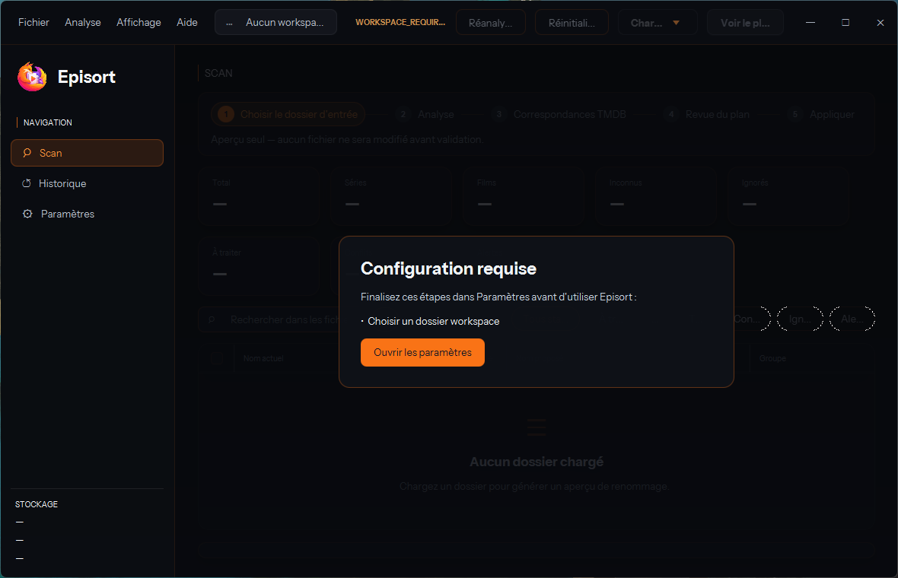

# Main window rendering verification

Verified on Windows 11 at 2560 × 1440 on 2026-08-12. The application was run
with an isolated empty profile so the captures contain no workspace or media
metadata.

## Native rendering evidence

| Check | Before | After |
| --- | --- | --- |
| Extended style | `0x80000` | `0x0` |
| `WS_EX_LAYERED` | present | absent |
| DWM corner preference | JavaFX root clip | `2` (`DWMWCP_ROUND`) |
| DWM immersive dark mode | enabled | enabled |

The opaque window removes the per-frame layered-window copy. During the same
drag and snap interactions, motion no longer shows the extra uneven cadence of
the layered path. Prism remains synchronized at 60 FPS, so a high-refresh-rate
display can still make Episort look less fluid than native applications that
render above 60 FPS; that residual difference is expected.

## Before / after

| Layered window | Opaque DWM window |
| --- | --- |
|  |  |

## Manual Windows checklist

The following checks exercise behavior that is owned by the JavaFX chrome and
cannot be covered by the OS-decision unit test alone:

- Restored window: inspect all four corners for DWM rounding and confirm there
  is no light or dark fringe over the desktop.
- Maximize button: confirm the window fills the work area and the corners become
  square. Restore it and confirm DWM rounding returns.
- Double-click an empty title-bar area: confirm maximize and restore behave like
  the button.
- Drag the title bar to the left and right screen edges: confirm the snap preview
  and half-screen placement still work, then drag away to restore.
- Resize from every edge and corner and confirm the 1180 × 760 minimum is still
  enforced.
- Enter and leave full screen, confirming square corners in full screen and
  rounded corners after restoration.
- Confirm the dark content theme remains active and the DWM immersive dark-mode
  attribute is still enabled.

The maximize button, double-click maximize/restore, left-edge snap, restored
rounding, maximized square corners, and dark-mode preservation were exercised in
the verification run. Edge/corner resizing, right-edge snap, and full screen
remain explicit pre-merge checks on a physical Windows desktop.

On Linux, start Episort and repeat drag, double-click, resize, maximize, and snap
checks where the window manager supports them. The DWM calls must be silent
no-ops and the opaque window outline remains square.

## Scan and plan interaction checklist

These checks are required on a physical Windows desktop before release:

- At a wide width, confirm media-kind filters sit at the table's left edge and
  status filters stop at its right edge, before the correspondence panel; narrow
  the window and confirm the two whole groups stack without clipping a chip.
- Double-click a cell in `Nom actuel` and confirm Explorer opens with the exact
  file selected. Confirm `Ouvrir la vidéo` remains a separate context-menu
  action and no playback starts from the double-click.
- Open a resolved movie and series TMDB link and confirm the canonical page
  matches the numeric identity shown in the detail card.
- For a series exposing several named episode groups of one type (Bleach has
  multiple Digital groups), confirm each group appears separately with its
  TMDB name and episode count, and switching among them keeps previously loaded
  episode choices available.
- In an exact plan containing a duplicate, compare both paths, sizes, and dates;
  choose deletion, apply the conflict decision, then confirm the final plan
  still requires the explicit validation step before any file is removed.
